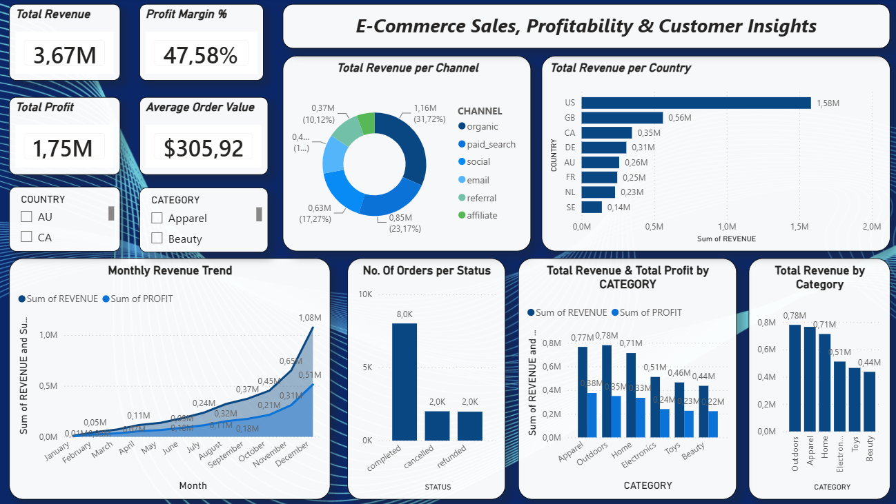

# E-Commerce Data Engineering Project

An end-to-end e-commerce data engineering and analytics project built using AWS S3, Snowflake, dbt, and Power BI.

The project demonstrates how raw e-commerce data can be collected, stored, transformed, tested, modeled, and ultimately presented as business-ready analytics.

## Project Overview

This project implements a modern ELT pipeline:

**AWS S3 → Snowflake → dbt → Power BI**

The pipeline takes raw e-commerce datasets stored in Amazon S3, loads them into Snowflake, transforms the data using dbt, applies data quality tests, creates analytical fact and dimension tables, and exposes the final data to Power BI for business reporting.

## Architecture

```text
                    E-Commerce Dataset
                            │
                            ▼
                       AWS S3
                    Raw Data Storage
                            │
                            ▼
                       Snowflake
                       RAW Layer
                            │
                            ▼
                          dbt
             ┌──────────────┼──────────────┐
             │              │              │
             ▼              ▼              ▼
          Staging      Intermediate      Marts
                                            │
                                            ▼
                                         Power BI
                                     Business Dashboard
| Technology   | Purpose                                   |
| ------------ | ----------------------------------------- |
| AWS S3       | Raw data storage                          |
| Snowflake    | Cloud data warehouse                      |
| dbt          | Data transformation, testing and modeling |
| Power BI     | Business intelligence and visualization   |
| Git / GitHub | Version control and portfolio management  |
| Python       | Local development environment             |

Data Source

The project uses the Synthetic E-Commerce Analytics Dataset by LaelaZ from Hugging Face.

The dataset contains five related tables:

Customers
Products
Orders
Order Items
Events

The dataset is synthetic and is used for learning and portfolio development.

Data Pipeline
1. AWS S3

The raw Parquet files are organized in Amazon S3 using the following structure:

zakheni-ecom/
└── ecommerce/
    └── raw/
        ├── customers/
        ├── products/
        ├── orders/
        ├── order_items/
        └── events/

2. Snowflake

Snowflake acts as the central data warehouse.

The raw datasets are loaded into the RAW schema and validated using row-count and referential-integrity checks.

3. dbt

dbt is used to transform the raw Snowflake data into analytics-ready models.

The transformation layer follows a layered approach:
RAW
 │
 ▼
STAGING
 │
 ▼
INTERMEDIATE
 │
 ▼
MARTS

Staging

The staging layer provides clean references to the raw Snowflake tables.

Models include:

stg_customers
stg_products
stg_orders
stg_order_items
stg_events
Intermediate

The intermediate layer performs business logic and enrichment.

Models include:

int_order_items_enriched
int_orders
Marts

The mart layer contains business-ready fact and dimension tables.

Fact tables
fct_orders
fct_order_items
Dimension tables
dim_customers
dim_products

The models follow a dimensional/star-schema approach, with the fact tables connected to customer and product dimensions.

Data Quality & Testing

The dbt project includes both generic data tests and custom business-rule tests.

The project successfully completed:

11 dbt models
18 data tests
29 total build operations
29 PASS
0 WARN
0 ERROR

Tests include:

Primary-key uniqueness
Not-null validation
Referential integrity
Positive order-item quantities
Non-negative prices
Non-negative costs
Profit calculation validation
Power BI Dashboard

The final analytical layer is connected to Power BI to provide an interactive e-commerce performance dashboard.




The dashboard includes:

Total Revenue
Total Profit
Total Orders
Profit Margin
Average Order Value
Revenue & Profit by Month
Revenue by Product Category
Profit by Product Category
Orders by Status
Revenue by Country
Revenue by Customer Channel

Interactive slicers allow users to explore the dashboard by:

Country
Product Category
Key Business Insights

The dashboard provides visibility into:

Revenue and profitability performance
Monthly revenue and profit trends
Product category performance
Order status distribution
Geographic revenue distribution
Customer acquisition channel performance
Average order value and profit margin
Project Structure
ecommerce-data-engineering/
│
├── analyses/
├── macros/
├── models/
│   ├── staging/
│   ├── intermediate/
│   ├── marts/
│   └── sources/
│
├── seeds/
├── snapshots/
├── tests/
│
├── .gitignore
├── dbt_project.yml
└── README.md
Future Improvements

Potential extensions to the project include:

Apache Airflow orchestration
Automated pipeline scheduling
dbt snapshots and Slowly Changing Dimensions
Incremental dbt models
Additional customer and event analytics
Automated cloud deployment
Author

Zakheni Mathonsi

This project was created as part of my data engineering portfolio to demonstrate practical experience with cloud storage, data warehousing, ELT, dimensional modeling, data quality, and business intelligence.